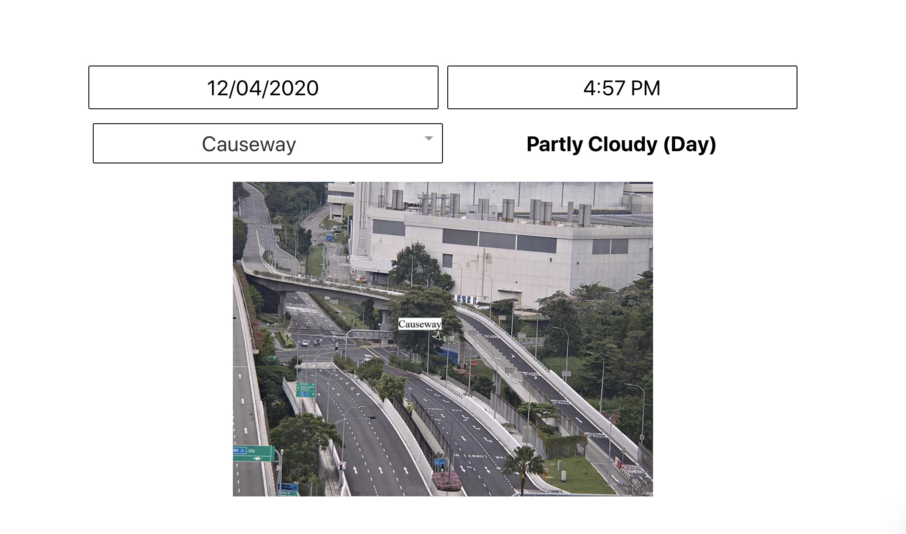
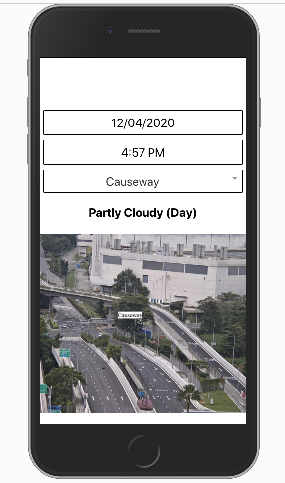

# Traffic and Weather Forecast App

This app displays traffic images and the nearby weather forecast from selected date, time and location. The location coordinates (latitude and longitude) and traffic images are taken from Data.gov.sg API. The location coordinates are then converted to readable location names using Mapquest API. The weather forecast which is based on a different set of location coordinates will be mapped to the nearest traffic location. The project uses create-react-app framework.

## API Services

1. Traffic Images (​https://data.gov.sg/dataset/traffic-images​)
2. Weather Forecast (​https://data.gov.sg/dataset/weather-forecast​)
3. Geocoding API (https://developer.mapquest.com/documentation/geocoding-api/batch/post/)

## Features

- User can select specified date, time and location to see traffic images and weather.

## Setting up the project

In the project directory, you can run:

### `yarn start`

Runs the app in the development mode.
Open [http://localhost:3000](http://localhost:3000) to view it in the browser.

### `yarn build`

Build for production mode

## Screenshots

